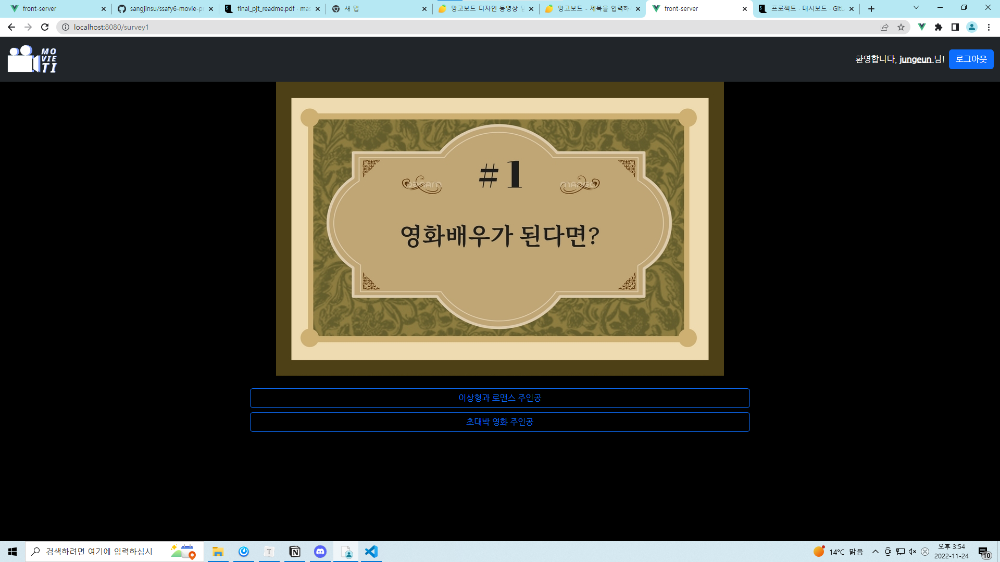
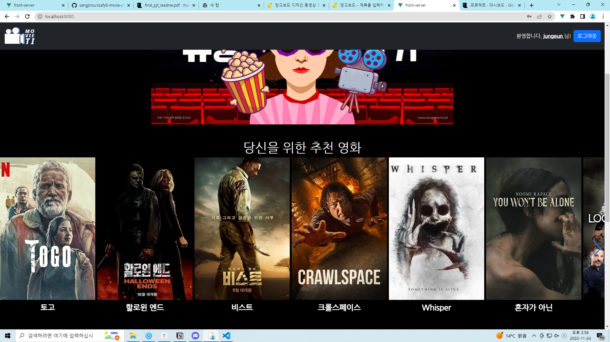
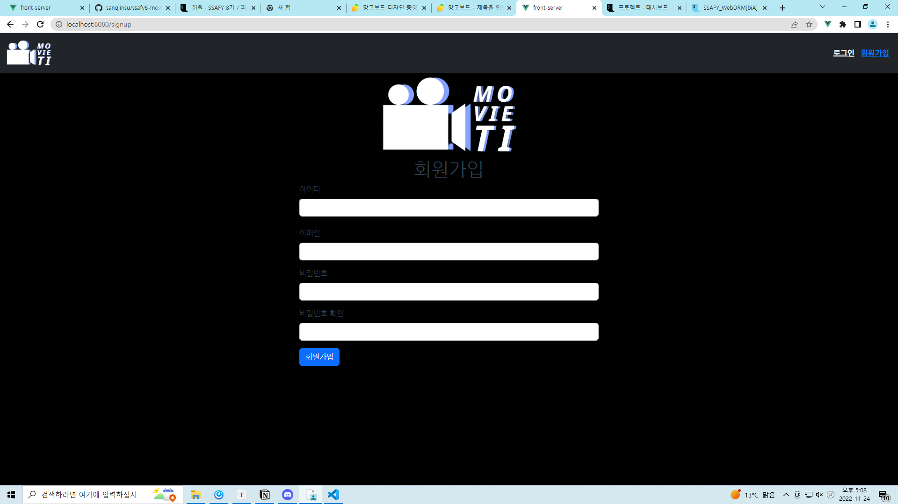
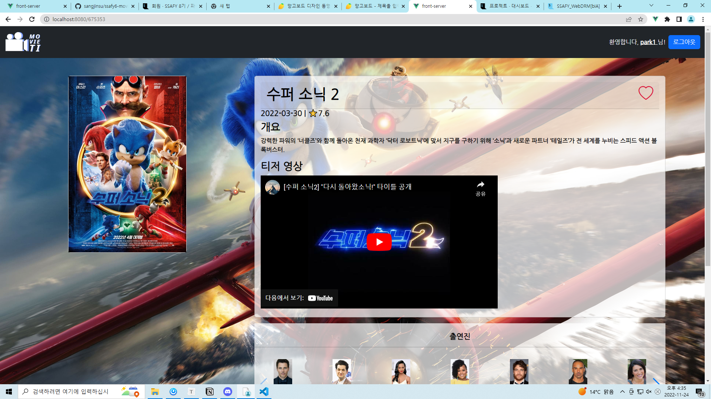
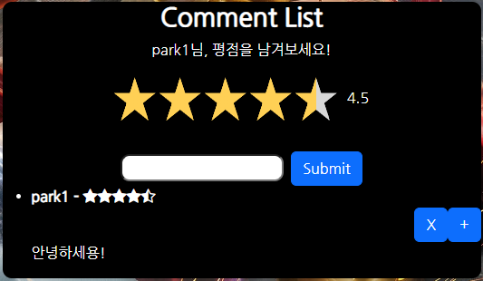

# 📽 SSAFY 8기 1학기 최종 프로젝트

#### - 영화 추천 알고리즘 기반 커뮤니티 서비스

## ⏲ 프로젝트 기간

- 2022.11.16(수) ~ 2022.11.24(목)

## 👨‍💻 팀원

- 팀장
  - 박정은: Back-end 전반, Accounts, Comment
- 팀원
  - 신동윤: Front-end 전반, Movies, 추천 알고리즘

## 📌목표

- 영화 데이터 기반 추천 서비스 구성
- 영화 추천 알고리즘 구성
- 커뮤니티 서비스 구성
- 서비스 관리 및 유지보수

## 💻개발 환경

- Front-end
  - vue: 2.6.14
- Back-end
  - Django REST Framework

## 🔩핵심 기능

- 회원가입 및 로그인
  - 토큰기반 인증 (Token-based Authentication) 방식을 이용
- 영화 목록
  - 영화 상세 정보
  - 유튜브 API를 이용한 예고편 출력
- 추천 알고리즘
  - 유형검사에 기반한 영화 추천 알고리즘
- 커뮤니티
  - 영화 코멘트와 평점 기능
  - 작성자 본인만 수정 / 삭제 가능
- 프로필 페이지
  - 좋아요한 영화, 남긴 댓글 출력

## 🔗 데이터베이스 모델링 (ERD)

## ⛓ 컴포넌트 구조

## 🧬 영화 추천 알고리즘

- Mvti라는 영화 취향 분석을 위한 유형 검사를 실시해 그 유형에 설정된 장르를 기반으로 영화 추천

  1. 메인페이지에서 배너를 이용해 유형 검사 페이지로 이동

     

  2. 유형 검사 페이지 (9개 문항)

     

     - 선택지에 따라 미리 나눠진 장르 그룹에 점수 부여

       

     - 설문 종료 후 상위 3개 그룹을 취합하여 미리 정해진 유형과 대조

       

       

  3. 결과 페이지

     

  - 알고리즘에 기반한 추천 영화 리스트 (메인 페이지 변화)

    

## 📑 서비스 대표 기능

### 💡 회원가입 및 로그인

- 토큰기반 인증 (Token-based Authentication) 방식을 이용

- 회원가입 페이지

  

  - JS 문법을 이용해 유효성 검사할 수 있게 함

    

- 로그인 페이지

  

### 💡 영화 디테일 페이지

- 그리드 시스템을 이용하여 반응형 웹디자인 구현

- 코멘트 기능

  

  - 영화에 평점 추가 기능
  - 작성자 본인만 수정 및 삭제 가능

### 💡 프로필 페이지

- MVTI 유형검사 결과를 확인하고 다른 유형의 영화추천이 궁금한 경우 다시 검사할 수 있도록 링크 첨부

- 영화 디테일 페이지에 남긴 코멘트와 좋아요한 영화 갯수 나타냄

- 스와이퍼를 사용해 좋아한 영화의 수가 화면을 벗어날 경우 넘겨서 확인할 수 있도록 구현

  

## 💯 느낀 점 및 후기

#### 박정은

비교적 최근에 배웠던 Vue.js 사용에는 큰 어려움이 없었으나 Django view 함수 사용에 정말 애를 많이 먹었다... 결국 프로젝트가 끝날 때쯤에 와서야 겨우 조금 다룰 줄 알게 된 것 같아서 아쉽다. 처음 계획에는 검색 기능과 영화 좋아요, 코멘트로 쌓을 수 있는 경험치를 구현해 회원 등급도 구성하고 싶었으나 시간부족과 능력부족으로 결국 여기서 마무리... 시간이 좀 더 많았다면 여러 사이트의 API를 가져와 더 많은 데이터를 다룰 수 있었을 듯. 그래도 처음으로 제대로 된 웹 사이트 구현에 성공한 것 같아 나름 만족! 이 경험을 발돋움으로 2학기 프로젝트 토대를 더욱 단단히 다질 수 있을 것 같다!

#### 신동윤

Vue.js를 이용할 때 컴포넌트를 구성하고, 페이지를 구현하는 데 많은 어려움을 느꼈습니다. axios를 이용하여 Django와 통신하고 데이터를 조작하는 것이 복잡하여 생각보다 많은 시간이 걸려 추후 이 부분을 보강할 계획입니다. 또한 CSS의 경우 처음 생각했던 디자인과는 조금은 다른 결과물을 구현하게 되어 아쉽습니다. position과 배치에 대해 많은 고민과 경험을 하며 추후 프로젝트를 진행할 때 도움이 될 거라 생각합니다.